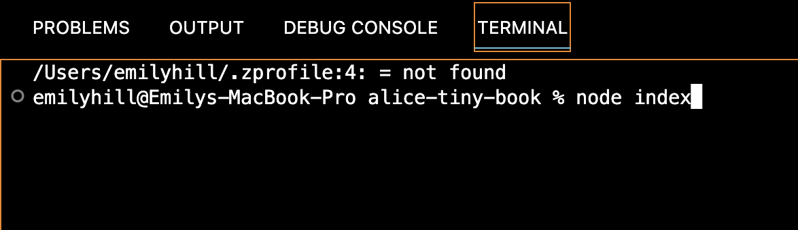
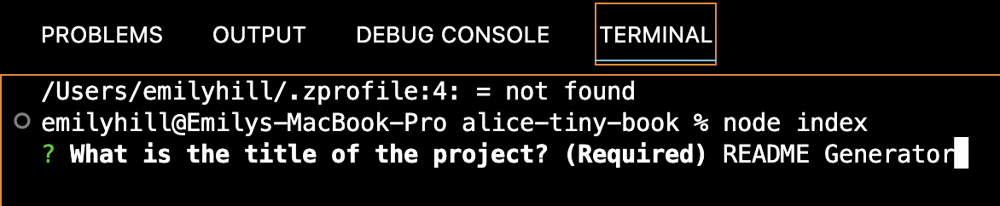
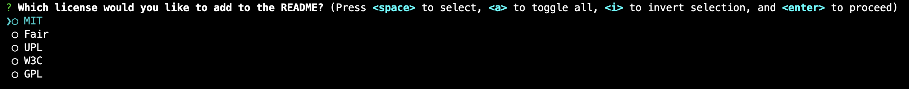
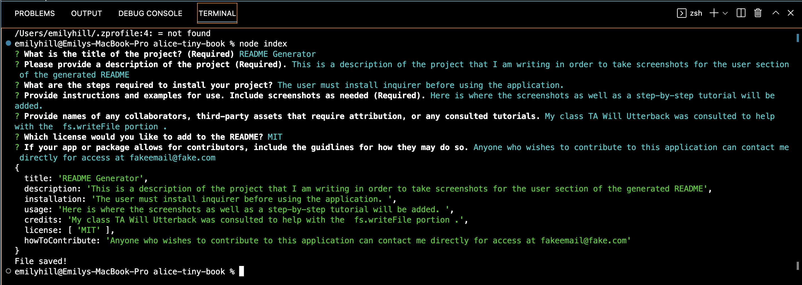
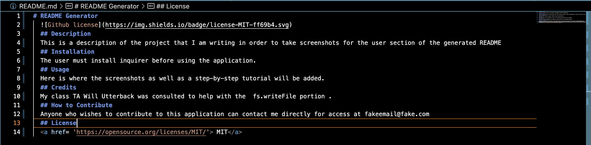
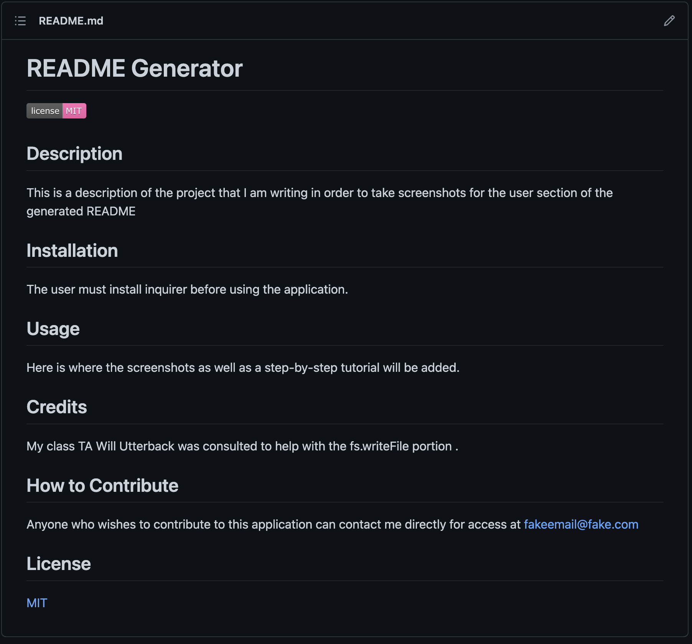

# README Generator 
  
  ## Description
  This project creates a README document using only node.js.

  ## Table of Contents 
  [Installation](#installation)
  [Usage](#usage)
  [Credits](#credits)
  [Tests](#tests)
  [Questions](#questions)
  [License](#license)
 

  ## Installation 
  There are no special steps required to install this project. 

  ## Usage
  First, the user will open their terminal and will start creating the document by typing in node index or node index.js . Then, the user will answer the prompt questions  and, when they reach the license selection, they will use the up/down arrow keys to indicate which license they would like and will use the space bar to make the selection .Once the user is done answering the prompts, the console will indicate that the entered data has been saved  Finally, the user can see the generated README in VS Code by selecting the README.md document . After doing a push to origin, the user can view the completed README on their Github account .

  ## Future Iterations 
  Future iterations of this project will include a working test. 

  ## Credits
  

  ## Tests
  npm test

  ## Questions
  If you have any questions, you can reach me at emsaw721 or fakeemail@fake.com.. 

  ## How to Contribute
  Contributors can contact me at my email fakeemail@fake.com.

  ## License
  <a href= 'https://opensource.org/licenses/MIT/'> MIT</a> 